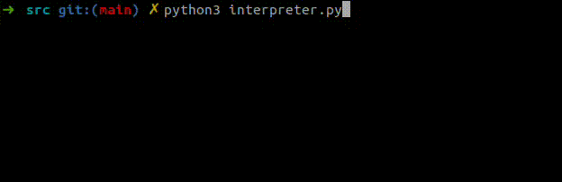

# Brainfuck to Text

A Brainfuck interpreter writing text depending on the input or file turned in



## What is Brainfuck?

Brainfuck is a minimalist esoteric programming language created by Urban Müller in 1993. It consists of only **eight commands** and operates on an array of memory cells, each initially set to zero. The language is known for its **extreme simplicity and difficulty to read**, making it a challenge for programmers.

### Brainfuck Commands:

| Command | Meaning |
|---------|---------|
| `>` | Move the memory pointer to the right |
| `<` | Move the memory pointer to the left |
| `+` | Increment the value at the current memory cell |
| `-` | Decrement the value at the current memory cell |
| `.` | Output the ASCII character at the current memory cell |
| `,` | Input a character and store it in the current cell |
| `[` | Jump past matching `]` if the current cell is 0 |
| `]` | Jump back to matching `[` if the current cell is nonzero |

## How to Use

### Install dependencies

```bash
$> apt install python3
```

### Run

#### Write & Execute

```bash
$> python3 src/interpreter.py
```

Write your **code** in the **shell** started by the script. When returning an **empty line**, the program should **automatically start running**.

Example:
```bash
code $> +++++>,<[>.<-]
```
This script should ask for any character on **input**, then **loop** and **write** it 5 times.

#### Input File

```bash
$> python3 src/interpreter.py
```

Write your **file path** in the **shell** started by the script. If the file does exists, then the script should **find**, **open** and **read** the file and **execute** it.

Example:
```bash
code $> ../examples/Count10.bf
```
This script should **write** every char from 0 to 9.

#### Argument File

```bash
$> python3 src/interpreter.py [FilePath]
```

Write your **file path** as an **argument** of the the script. If the file does exists, then the script should **find**, **open** and **read** the file and **execute** it.

Example:
```bash
$> python3 src/interpreter.py ../examples/HelloWorld.bf
```
This script should write the famous **"Hello World!"** sentence.

